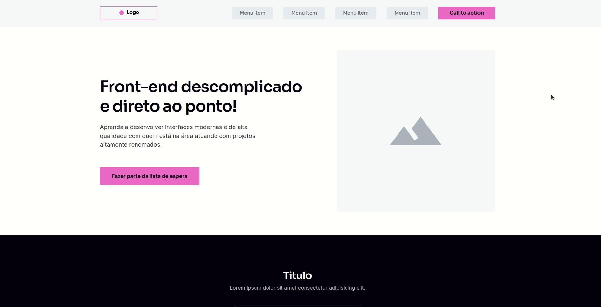
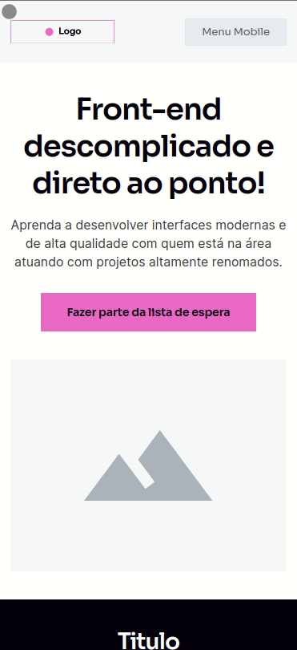

<h1 align="center">
    <a href="https://paulomvrech.github.io/wireframe-project/" target="_blank">Projeto WireFrame - Codeboost</a>
</h1>

## 💻 Sobre o projeto
Wireframe desenvolvido em um dos módulos do curso **[Codeboost](https://codeboost.com.br/)**.

Realizei o deploy deste projeto no Github Pages, [clique aqui](https://paulomvrech.github.io/wireframe-project/) para conferir.

---

## 👀 Demo
- Versão Desktop
<div align="center">
    
</div>

- Versão Mobile
<div align="center">
    
</div>


---

## 🚀 Tecnologias utilizadas

Esse projeto foi desenvolvido utilizando as seguintes tecnologias:

- HTML5
- CSS3

---

## 🛠 Como executar o projeto em sua máquina

```bash

# Clone este repositório
$ git clone git@github.com:paulomvrech/wireframe-project.git

# Acesse a pasta do projeto no seu terminal/cmd
$ cd wireframe-project

# Execute o arquivo index.html em seu navegador


```

---

<p align="center">Desenvolvido por 👏 Paulo Muller Vrech</p>